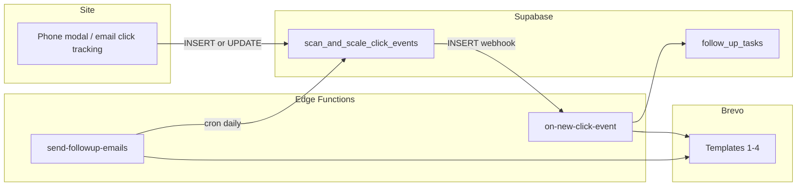

# SOP: Recreate the Scan & Scale Click-Event Funnel for a New Niche

**Applies to:** `salesMastery/eCommerceSite/scan-and-scale/scan-scale-funnel`  
**Reference fork:** `salesMastery/eCommerceSite/scan-and-scale/funnels/magicBands`  
**Last updated:** 2026-05-17

---

## 1. What you are building

A **lead-triggered email automation stack** tied to Supabase:

| Layer | Role |
|--------|------|
| **Site / API** | Writes leads into `public.scan_and_scale_click_events` |
| **DB webhook** | `INSERT` on that table → Edge Function `on-new-click-event` |
| **Immediate automation** | Owner alert → Email 1 (CTA stripped at runtime) → optional call task |
| **Daily cron** | Edge Function `send-followup-emails` → Emails 2–4 on day 2 / 4 / 6 |



**Important:** Automation runs on **`INSERT` only** (database webhook). Updates (e.g. adding phone to an existing row) do **not** re-fire the webhook.

---

## 2. Prerequisites

| Requirement | Notes |
|-------------|--------|
| **Supabase project** | Same project as the storefront, or a dedicated project per niche |
| **Brevo account** | Verified sender; API key with SMTP/template + transactional send |
| **Node ≥ 18** | For `scripts/create-brevo-templates.mjs` |
| **Supabase CLI** | `supabase link`, `functions deploy`, `secrets set` |
| **Base table** | `scan_and_scale_click_events` (see `salesMastery/playwrightAutomation/scripts/scan_and_scale_click_events.sql`) |

---

## 3. Choose your niche strategy

### Option A — Copy folder (recommended; matches MagicBands)

- Duplicate `scan-scale-funnel` → `funnels/{yourNiche}/`
- New email HTML under `salesMastery/emailSequences/{yourNiche}Sequence/`
- Customize copy in Edge Functions + Brevo script
- **Same** `scan_and_scale_click_events` table; segment leads with `last_click_campaign`

**Constraint:** Supabase allows **one** webhook URL per `INSERT` on a table. Only **one** deployed `on-new-click-event` can be active per project unless you add routing logic (see Option C).

### Option B — Separate Supabase project per niche

- Full isolation: own table, webhook, secrets, Brevo templates
- More ops overhead; no webhook collision

### Option C — Single funnel, campaign router (future-proof)

- One `on-new-click-event` that branches on `last_click_campaign` or `funnel_name`
- Multiple Brevo template maps in config
- **Not implemented today** — `funnel_name` in `settings.json` is unused in code

---

## 4. Niche definition checklist (before coding)

Fill this in once per niche:

| Item | Example (Scan & Scale) | Your niche |
|------|------------------------|------------|
| **Slug** | `scan_and_scale` | ____________ |
| **Display name** | Scan & Scale | ____________ |
| **Owner alert email** | `team@seamlessly.us` | ____________ |
| **Email 1 booking CTA URL** | `https://seamlessly.us/calculator/sports` | ____________ |
| **Email 1 secondary CTA** (kept after strip) | products / guide URL | ____________ |
| **Default Email 1 subject** (fallback in code) | concession lines… | ____________ |
| **Call task notes** | DFY consultation copy | ____________ |
| **Campaign query values** | `scan-scale-*` | ____________ |
| **Template file prefix** | `scan_scale_email_00N.html` | ____________ |
| **Sequence folder** | `emailSequences/scanAndScaleSequence` | ____________ |

---

## 5. Step-by-step recreation

### Phase 1 — Email content (4 emails)

1. Create folder:

   `salesMastery/emailSequences/{Niche}Sequence/`

2. Add four HTML files:

   - `{prefix}_email_001.html` … `_004.html`

3. **Email 1 must include two CTAs** (automation depends on this):

   - **Primary:** `class="cta-btn"` + booking `href` → stripped at send time
   - **Secondary:** `class="cta-btn"` + different `href` → left intact (guide/product)

   Scan & Scale primary CTA pattern:

   ```html
   <a class="cta-btn" href="https://seamlessly.us/calculator/sports" target="_blank">
     BOOK YOUR FREE REVENUE FIT SESSION →
   </a>
   ```

4. Emails 2–4: sent as-is from Brevo (no runtime strip).

5. Align subjects with the 4-email arc: Mirror → Proof → Cost of waiting → Decision. Mirror `SPECS` in `scripts/create-brevo-templates.mjs`.

---

### Phase 2 — Copy the funnel package

```bash
cd salesMastery/eCommerceSite/scan-and-scale
cp -R scan-scale-funnel funnels/{yourNiche}
```

**Layout to keep:**

| Path | Purpose |
|------|---------|
| `config/settings.json` | Owner email, funnel slug (documentation today) |
| `config/brevo-templates.json` | Filled by script — redeploy after changes |
| `scripts/create-brevo-templates.mjs` | Uploads HTML → Brevo; writes template IDs |
| `functions/` | `on-new-click-event`, `send-followup-emails`, `_shared/*` |
| `supabase/functions/*/index.ts` | Thin Deno entrypoints |
| `migrations/` | Funnel columns + `follow_up_tasks` (idempotent) |

---

### Phase 3 — Customize code & config

#### 3a. `config/settings.json`

```json
{
  "owner_notification_email": "you@yourdomain.com",
  "funnel_name": "your_niche_slug",
  "email_sequence_days": [0, 2, 4, 6]
}
```

> **Note:** `email_sequence_days` is **not wired** to `send-followup-emails.ts` (delays are hardcoded at 2, 4, 6 days). Edit `send-followup-emails.ts` if you need different timing.

#### 3b. `scripts/create-brevo-templates.mjs`

Update:

- Default template directory → your `emailSequences/{Niche}Sequence`
- `SPECS[]`: filenames, `templateName`, `subject` per email
- Optional: rename `SCAN_SCALE_EMAIL_TEMPLATE_DIR` to a niche-neutral env var when forking

#### 3c. `functions/on-new-click-event.ts`

| Location | What to change |
|----------|----------------|
| `buildOwnerNotificationHtml` | Heading (“New … lead notification”) |
| Owner email `subject` | `🔔 New … Lead:` |
| Default Email 1 `sendSubject` fallback | Your Email 1 subject |
| `follow_up_tasks` `notes` | Call-task description |

#### 3d. `functions/_shared/brevo.ts` — critical

Update `stripBookingCtaFromEmailOneHtml` regex to match **your** Email 1 booking `href`:

```ts
export function stripBookingCtaFromEmailOneHtml (html: string): string {
  const pattern =
    /<a\s+[^>]*class="cta-btn"[^>]*href="YOUR_BOOKING_URL_ESCAPED"[^>]*>\s*BOOK\s+YOUR\s+FREE\s+REVENUE\s+FIT\s+SESSION\s*→\s*<\/a>/i;
  return html.replace (pattern, '');
}
```

MagicBands templates use `calculator/magic-bands` but the forked `brevo.ts` still targets the sports URL — fix this when cloning.

#### 3e. Table name (only if Option B / full isolation)

If you use a new table (e.g. `{niche}_click_events`):

- New base SQL (copy `scan_and_scale_click_events.sql`)
- Update migration FK on `follow_up_tasks.click_event_id`
- Replace every `.from('scan_and_scale_click_events')` in both functions
- Point the database webhook at the new table

---

### Phase 4 — Database

**If funnel columns are not applied yet** (once per Supabase project):

1. Run base table SQL: `salesMastery/playwrightAutomation/scripts/scan_and_scale_click_events.sql`
2. Run funnel migration: `migrations/20250515130000_scan_scale_funnel_columns_and_follow_up_tasks.sql`

Adds:

- `funnel_stage`, `emails_sent`, `call_task_created`, `notification_sent`
- `follow_up_tasks` (RLS on; no anon policies — Edge uses service role)

**Lead capture on the site** (`salesMastery/eCommerceSite/scan-and-scale/backend/api/logSiteEvent.js`):

- `phone_capture` → INSERT if new email → **triggers funnel**
- Email in `contact` query param → upsert `last_click_*` (INSERT only if new)

Wire campaigns in frontend (`?campaign=your-niche-001`) for reporting.

---

### Phase 5 — Brevo templates

```bash
cd salesMastery/eCommerceSite/scan-and-scale/funnels/{yourNiche}
export BREVO_API_KEY="xkeysib-..."
export SCAN_SCALE_EMAIL_TEMPLATE_DIR="/absolute/path/to/emailSequences/{Niche}Sequence"  # optional
node scripts/create-brevo-templates.mjs
```

Writes `config/brevo-templates.json` with numeric template IDs. **Redeploy Edge Functions** after this step.

---

### Phase 6 — Deploy Edge Functions

```bash
cd salesMastery/eCommerceSite/scan-and-scale/funnels/{yourNiche}
supabase link --project-ref <ref>   # first time

supabase secrets set BREVO_API_KEY="<key>"
# If not auto-injected by Supabase:
supabase secrets set SUPABASE_URL="https://<ref>.supabase.co" SUPABASE_SERVICE_ROLE_KEY="<srk>"

supabase functions deploy on-new-click-event --no-verify-jwt
supabase functions deploy send-followup-emails --no-verify-jwt
```

`verify_jwt = false` is required for Database Webhooks and cron unless you forward a valid JWT.

---

### Phase 7 — Webhook & scheduler

#### Webhook (`on-new-click-event`)

Supabase Dashboard → **Database → Webhooks**:

| Setting | Value |
|---------|--------|
| Table | `public.scan_and_scale_click_events` |
| Event | `INSERT` |
| URL | `https://<ref>.supabase.co/functions/v1/on-new-click-event` |
| Payload | Include new row (`record`) |
| JWT | Off (unless deploy enforces JWT + you forward a token) |

#### Cron (`send-followup-emails`)

Schedule **daily** (Dashboard → Edge Functions → Cron), or invoke manually:

```bash
curl -X POST "https://<ref>.supabase.co/functions/v1/send-followup-emails" \
  -H "Authorization: Bearer $SUPABASE_SERVICE_ROLE_KEY"
```

| `emails_sent` | Min age (`created_at`) | Sends |
|---------------|------------------------|--------|
| 1 | 2 days | Email 2 |
| 2 | 4 days | Email 3 |
| 3 | 6 days | Email 4 |

---

### Phase 8 — Storefront integration

| Piece | Path |
|-------|------|
| Phone capture modal | `scan-and-scale/public/js/phone-modal.js` |
| Site events API | `scan-and-scale/backend/api/logSiteEvent.js` |
| Env | `SUPABASE_SCAN_AND_SCALE_URL`, `SUPABASE_SCAN_AND_SCALE_ANON_KEY` (or `VITE_*`) |
| Niche pages / calculator | `public/` or `funnels/{niche}/` |
| Stripe products | `scan-and-scale/config/stripe-products.js` |

For a new niche: landing pages, calculator, implementation guide, and `campaign` params on links and emails.

---

### Phase 9 — Verification

#### Smoke: webhook

```bash
curl -X POST "https://<ref>.supabase.co/functions/v1/on-new-click-event" \
  -H "Content-Type: application/json" \
  -d '{"record":{"id":"<uuid-from-insert>","email":"test@example.com","name":"Test","phone":"5551234567"}}'
```

Expect:

1. Owner notification to `owner_notification_email`
2. Lead receives Email 1 **without** booking CTA
3. Row: `notification_sent=true`, `emails_sent=1`, `funnel_stage=email_1_sent`
4. If phone present: row in `follow_up_tasks`, `call_task_created=true`

#### Smoke: follow-ups

Insert a row with `emails_sent=1` and `created_at` ≥ 2 days ago → run `send-followup-emails` → `emails_sent=2`.

#### Troubleshooting

| Symptom | Check |
|---------|--------|
| 401 on webhook/cron | JWT verification; Authorization header |
| No Email 1 / CTA still there | `stripBookingCtaFromEmailOneHtml` href vs HTML; redeploy |
| No follow-ups | Cron running; `brevo-templates.json` IDs; `created_at` age |
| Duplicate emails | Webhook retries; flags `notification_sent` / `emails_sent` |
| Funnel never starts | Was it UPDATE not INSERT? Use new email or delete row |

---

## 6. File-by-file customization matrix

| File | Scan & Scale | New niche action |
|------|--------------|------------------|
| `emailSequences/...` | 4 HTML emails | **Create new sequence** |
| `config/settings.json` | owner email, slug | **Update** |
| `scripts/create-brevo-templates.mjs` | paths, names, subjects | **Update** |
| `functions/on-new-click-event.ts` | notification + task copy | **Update** |
| `functions/_shared/brevo.ts` | CTA strip regex | **Update href** |
| `functions/send-followup-emails.ts` | table name, day offsets | Update only if needed |
| `migrations/*.sql` | once per project | Re-run safe (`IF NOT EXISTS`) |
| `supabase/config.toml` | `project_id` | Set on `supabase link` |
| Site `logSiteEvent.js` | shared | Campaign params; new table only if isolating |
| Funnel `README.md` | ops notes | Optional team copy |

**Never commit:** `BREVO_API_KEY`, service role key, `.env`

---

## 7. Runtime behavior reference

**`on-new-click-event` (order):**

1. Owner HTML email → `notification_sent = true`
2. Fetch Brevo template 1 → strip booking CTA → transactional send → `emails_sent = 1`, `funnel_stage = email_1_sent`
3. If `phone` → insert `follow_up_tasks` → `call_task_created = true`

**`send-followup-emails`:** Brevo template send for emails 2–4 with optimistic `WHERE emails_sent = n`.

---

## 8. Operational notes

- **One active webhook per table per project** — deploying a second niche’s functions overwrites the handler unless you use a campaign router or separate projects.
- **Template ID changes** → rerun Brevo script → redeploy both functions.
- **Idempotency** — safe webhook retries; follow-ups use `emails_sent` guards.
- **`follow_up_tasks`** — query in Supabase SQL editor for sales follow-up; not exposed to anon clients.

---

## 9. Quick clone command summary

```bash
# 1. Content
mkdir -p salesMastery/emailSequences/{Niche}Sequence
# ... author 4 HTML files ...

# 2. Funnel package
cp -R salesMastery/eCommerceSite/scan-and-scale/scan-scale-funnel \
      salesMastery/eCommerceSite/scan-and-scale/funnels/{Niche}

# 3. Edit config, script SPECS, on-new-click-event copy, brevo.ts CTA regex

# 4. DB (once per project)
#    → scan_and_scale_click_events.sql + funnel migration

# 5. Brevo + deploy
cd salesMastery/eCommerceSite/scan-and-scale/funnels/{Niche}
export BREVO_API_KEY="..."
node scripts/create-brevo-templates.mjs
supabase functions deploy on-new-click-event --no-verify-jwt
supabase functions deploy send-followup-emails --no-verify-jwt

# 6. Configure INSERT webhook + daily cron

# 7. Smoke test with curl + test inbox
```

---

## 10. Reference paths (monorepo)

| Asset | Path |
|-------|------|
| Canonical funnel | `salesMastery/eCommerceSite/scan-and-scale/scan-scale-funnel/` |
| Niche fork example | `salesMastery/eCommerceSite/scan-and-scale/funnels/magicBands/` |
| Email templates (Scan & Scale) | `salesMastery/emailSequences/scanAndScaleSequence/` |
| Email templates (MagicBands) | `salesMastery/emailSequences/magicBandsSequence/` |
| Base leads table SQL | `salesMastery/playwrightAutomation/scripts/scan_and_scale_click_events.sql` |
| Site lead API | `salesMastery/eCommerceSite/scan-and-scale/backend/api/logSiteEvent.js` |
| Funnel README (deploy detail) | `salesMastery/eCommerceSite/scan-and-scale/scan-scale-funnel/README.md` |
