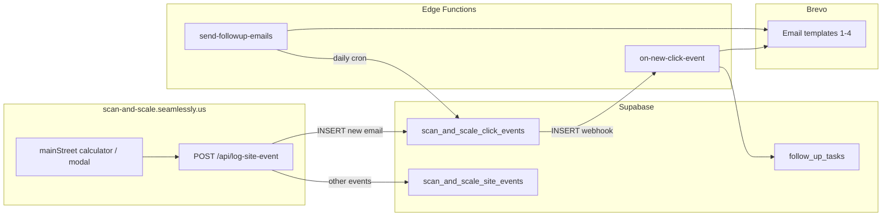

# Main Street funnel — Supabase setup

This funnel uses the **same Supabase project and tables** as Scan & Scale (SOP Option A). Leads are segmented by `last_click_campaign` (`main-street-*`). You do **not** need a separate table unless you want full isolation (Option B in the SOP).

**Reference SOP:** `operatingSeamlessly/Automatins/SOPs/scan-scale-click-event-funnel.md`  
**Canonical Edge Function package:** `eCommerceSite/scan-and-scale/scan-scale-funnel/`  
**Main Street site config:** `mainStreet/config/settings.json`

---

## Architecture



**Critical:** Automation runs on **`INSERT` only** on `scan_and_scale_click_events`. If the email already exists, `logSiteEvent` **UPDATE**s the row and the webhook does **not** fire again.

---

## Phase 0 — Prerequisites

| Item | Notes |
|------|--------|
| Supabase project | Same project as Scan & Scale (e.g. ref `smqwemfobrqxnpcooigd`) |
| Brevo account | Verified sender; API key with template + transactional send |
| Supabase CLI | `supabase login`, `supabase link` |
| Vercel env on scan-and-scale | `SUPABASE_SCAN_AND_SCALE_URL` / `SUPABASE_SCAN_AND_SCALE_ANON_KEY` (or `VITE_*`) for `/api/log-site-event` |
| Edge secrets | `BREVO_API_KEY`, `SUPABASE_SERVICE_ROLE_KEY`, `SUPABASE_URL` |

---

## Phase 1 — Database (run once per project)

Run in **Supabase Dashboard → SQL Editor** in this order.

### 1a. Base leads table

File: `salesMastery/playwrightAutomation/scripts/scan_and_scale_click_events.sql`

Creates:

| Object | Purpose |
|--------|---------|
| `public.scan_and_scale_click_events` | One row per email (unique on `lower(email)`) |
| Columns | `email`, `name`, `phone`, `company`, `last_click_path`, `last_click_campaign`, `last_click_at`, timestamps |
| RLS | `anon` can SELECT / INSERT / UPDATE (site upsert via anon key) |

### 1b. Funnel columns + call tasks

File: `eCommerceSite/scan-and-scale/scan-scale-funnel/migrations/20250515130000_scan_scale_funnel_columns_and_follow_up_tasks.sql`

Adds to `scan_and_scale_click_events`:

| Column | Default | Purpose |
|--------|---------|---------|
| `funnel_stage` | `new_lead` | e.g. `email_1_sent` … `email_4_sent` |
| `emails_sent` | `0` | Count of sequence emails sent (0–4) |
| `call_task_created` | `false` | Set when `follow_up_tasks` row created |
| `notification_sent` | `false` | Owner alert sent |

Creates:

| Table | Purpose |
|-------|---------|
| `public.follow_up_tasks` | Internal call queue (`task_type` = `call`, links to `click_event_id`) |
| RLS on `follow_up_tasks` | **No anon policies** — only service role (Edge Functions) |

### 1c. Site events (optional analytics)

File: `eCommerceSite/scan-and-scale/supabase/scan_and_scale_site_events.sql`

Append-only `scan_and_scale_site_events` for page views / clicks (not required for email automation).

### 1d. Main Street — store Program/City

The starter-kit modal sends `program_city`. The API should map it to **`company`** on the lead row (column already exists). Until `logSiteEvent.js` is updated, you can still filter leads by `last_click_campaign = 'main-street-starter-kit'`.

---

## Phase 2 — Email content (4 templates)

1. Create folder: `salesMastery/emailSequences/mainStreetSequence/`
2. Add four HTML files (mirror Scan & Scale structure):
   - `main_street_email_001.html` … `_004.html`
3. **Email 1 must have two CTAs:**
   - **Primary** (stripped at send): `class="cta-btn"` + booking URL → `https://calendly.com/staying-ahead-of-the-game/seamless-chat-clone`
   - **Secondary** (kept): `class="cta-btn"` + playbook URL → `https://scan-and-scale.seamlessly.us/mainStreet/playbook`
4. Subjects: Mirror → Proof → Cost of waiting → Decision (see `scan-scale-funnel/scripts/create-brevo-templates.mjs` `SPECS`).

---

## Phase 3 — Fork Edge Function package for Main Street

```bash
cd salesMastery/eCommerceSite/scan-and-scale
cp -R scan-scale-funnel funnels/mainStreet
# or: mainStreet/funnel/ if you colocate under mainStreet
```

Customize in the fork:

| File | Main Street changes |
|------|---------------------|
| `config/settings.json` | Copy from `mainStreet/config/settings.json` — owner email, `funnel_name: main_street` |
| `scripts/create-brevo-templates.mjs` | Point `SPECS` at `mainStreetSequence`, template names, subjects |
| `functions/on-new-click-event.ts` | Owner subject/body: “New Main Street lead”; call task notes for district programs |
| `functions/_shared/brevo.ts` | `stripBookingCtaFromEmailOneHtml` regex must match Email 1 **booking** `href` (Calendly URL above) |
| `functions/send-followup-emails.ts` | Usually unchanged (same table, same day offsets 2/4/6) |

### Upload Brevo templates

```bash
cd salesMastery/eCommerceSite/scan-and-scale/funnels/mainStreet   # your fork path
export BREVO_API_KEY="xkeysib-..."
export SCAN_SCALE_EMAIL_TEMPLATE_DIR="/absolute/path/to/salesMastery/emailSequences/mainStreetSequence"
node scripts/create-brevo-templates.mjs
```

Writes `config/brevo-templates.json` with numeric template IDs. **Redeploy Edge Functions** after this.

---

## Phase 4 — Deploy Edge Functions

```bash
cd salesMastery/eCommerceSite/scan-and-scale/funnels/mainStreet   # fork path
supabase link --project-ref <your-ref>

supabase secrets set BREVO_API_KEY="<key>"
# If not auto-injected:
supabase secrets set SUPABASE_URL="https://<ref>.supabase.co" SUPABASE_SERVICE_ROLE_KEY="<service-role-key>"

supabase functions deploy on-new-click-event --no-verify-jwt
supabase functions deploy send-followup-emails --no-verify-jwt
```

`verify_jwt = false` is required for **Database Webhooks** and **cron** unless you forward a valid JWT.

---

## Phase 5 — Database webhook

**Dashboard → Database → Webhooks → Create**

| Setting | Value |
|---------|--------|
| Name | `main-street-on-new-click-event` (or shared Scan & Scale name) |
| Table | `public.scan_and_scale_click_events` |
| Events | **Insert** |
| Method | POST |
| URL | `https://<project-ref>.supabase.co/functions/v1/on-new-click-event` |
| Headers | `Content-Type: application/json` |
| Payload | Include `record` (full new row) |
| JWT / auth | Off (matches `--no-verify-jwt`) |

### Webhook collision warning

Only **one** active `INSERT` webhook per table per project can call one function URL. If Scan & Scale and Main Street both deploy different `on-new-click-event` handlers, the **last deploy wins**. Options:

- **Shared handler** + branch on `last_click_campaign` (`main-street-*` vs `scan-scale-*`), or  
- **Separate Supabase project** for Main Street (Option B).

---

## Phase 6 — Cron (follow-up emails 2–4)

**Dashboard → Edge Functions → `send-followup-emails` → Schedules**

| Schedule | Suggested |
|----------|-----------|
| Cron | Daily (e.g. `0 14 * * *` UTC) |
| Method | POST |
| Path | `/functions/v1/send-followup-emails` |
| Authorization | Bearer `<SUPABASE_SERVICE_ROLE_KEY>` |

Manual test:

```bash
curl -X POST "https://<ref>.supabase.co/functions/v1/send-followup-emails" \
  -H "Authorization: Bearer $SUPABASE_SERVICE_ROLE_KEY"
```

| `emails_sent` | Min age (`created_at`) | Sends |
|---------------|------------------------|--------|
| 1 | 2 days | Email 2 |
| 2 | 4 days | Email 3 |
| 3 | 6 days | Email 4 |

---

## Phase 7 — Vercel / site wiring

Ensure **scan-and-scale** Vercel project has:

| Env var | Purpose |
|---------|---------|
| `SUPABASE_SCAN_AND_SCALE_URL` | Supabase project URL |
| `SUPABASE_SCAN_AND_SCALE_ANON_KEY` | Anon key for `logSiteEvent` |

Main Street frontend posts to **`POST /api/log-site-event`** with:

| Field | Main Street value |
|-------|---------------------|
| `event_type` | `phone_capture` |
| `campaign` | `main-street-starter-kit` (modal) or `main-street-retention-001` (calculator) |
| `name`, `email`, `phone` | Required for `phone_capture` |
| `program_city` | Map to `company` in API (recommended) |
| `page_path` | e.g. `/mainStreet/calculator/results` |

---

## Phase 8 — Verification

### Smoke: new lead → webhook

1. Submit starter-kit modal with a **new** email + phone.
2. Confirm row in `scan_and_scale_click_events`:
   - `last_click_campaign` = `main-street-starter-kit`
   - `funnel_stage` = `email_1_sent`, `emails_sent` = 1
   - `notification_sent` = true
3. Lead receives Email 1 **without** booking CTA (stripped).
4. If phone present: row in `follow_up_tasks`, `call_task_created` = true.

```bash
curl -X POST "https://<ref>.supabase.co/functions/v1/on-new-click-event" \
  -H "Content-Type: application/json" \
  -d '{"record":{"id":"<uuid-from-insert>","email":"test@example.com","name":"Test Coordinator","phone":"5551234567","last_click_campaign":"main-street-starter-kit"}}'
```

### Smoke: follow-ups

Insert or use a test row with `emails_sent = 1` and `created_at` ≥ 2 days ago → run `send-followup-emails` → `emails_sent` becomes 2.

### Troubleshooting

| Symptom | Check |
|---------|--------|
| No Email 1 | Webhook on INSERT? Secrets? Brevo template IDs in `brevo-templates.json`? |
| Booking CTA still in Email 1 | `stripBookingCtaFromEmailOneHtml` href must match HTML; redeploy |
| Funnel never starts | Row was UPDATE not INSERT — use new email or delete row |
| No call task | `phone` empty on INSERT record |
| Wrong sequence copy | Deployed wrong `on-new-click-event` (webhook collision) |

---

## Campaign reference

| Campaign | When |
|----------|------|
| `main-street-starter-kit` | 5s modal on results (starter kit) |
| `main-street-retention-001` | Calculator / paid traffic (use on links `?campaign=`) |

Filter leads in SQL:

```sql
SELECT email, name, phone, company, last_click_campaign, funnel_stage, emails_sent, created_at
FROM public.scan_and_scale_click_events
WHERE last_click_campaign LIKE 'main-street%'
ORDER BY created_at DESC;
```

Pending call tasks:

```sql
SELECT t.*, c.last_click_campaign
FROM public.follow_up_tasks t
JOIN public.scan_and_scale_click_events c ON c.id = t.click_event_id
WHERE t.status = 'pending'
  AND c.last_click_campaign LIKE 'main-street%'
ORDER BY t.created_at DESC;
```

---

## Checklist (copy/paste)

- [ ] Run `scan_and_scale_click_events.sql`
- [ ] Run funnel migration SQL (`funnel_stage`, `follow_up_tasks`, …)
- [ ] Run `scan_and_scale_site_events.sql` (optional)
- [ ] Create `emailSequences/mainStreetSequence/` (4 HTML emails)
- [ ] Fork `scan-scale-funnel` → customize + `create-brevo-templates.mjs`
- [ ] `node scripts/create-brevo-templates.mjs` → `brevo-templates.json`
- [ ] `supabase secrets set` (Brevo + service role)
- [ ] Deploy `on-new-click-event` + `send-followup-emails`
- [ ] Configure INSERT webhook on `scan_and_scale_click_events`
- [ ] Configure daily cron for `send-followup-emails`
- [ ] Vercel env: Supabase URL + anon key for `/api/log-site-event`
- [ ] Smoke test: new email INSERT → Email 1 + owner alert + call task
